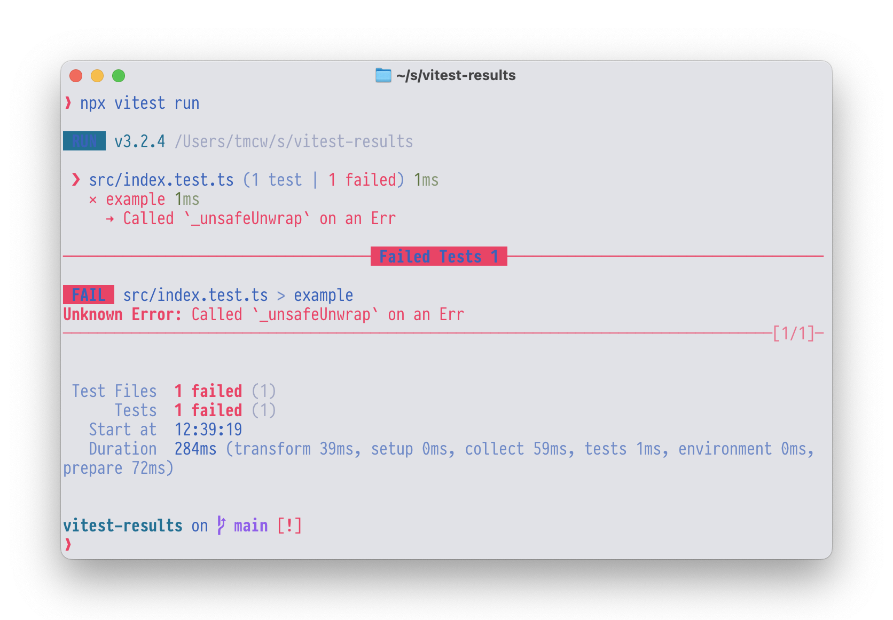
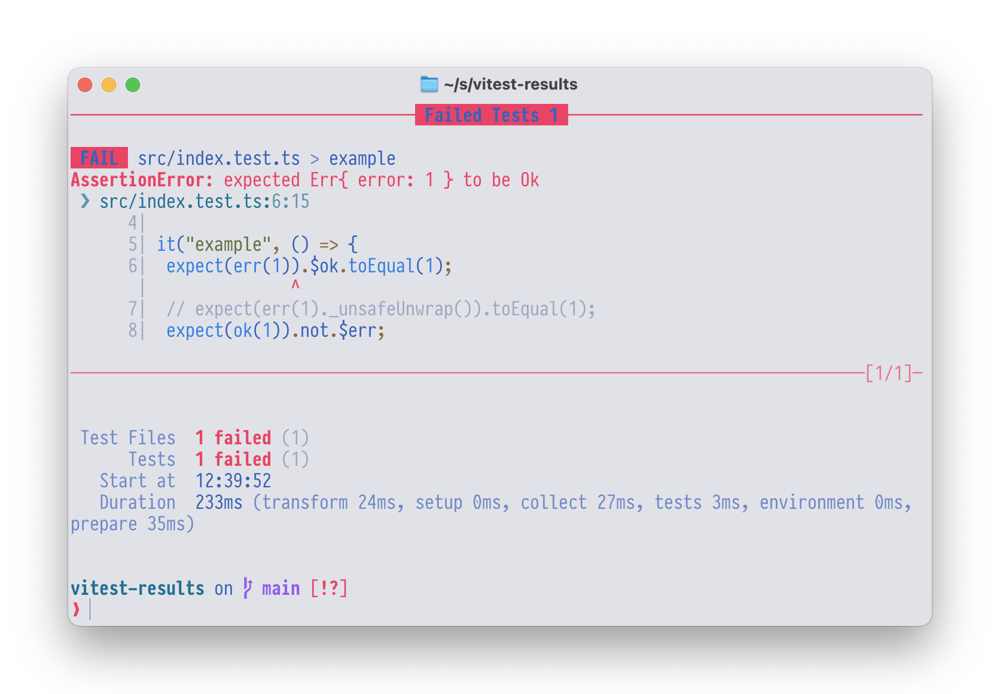

# vitest-results

[GitHub] | [NPM]

A [Vitest](https://vitest.dev/) extension to make it easier to
test [neverthrow](https://github.com/supermacro/neverthrow)
Result and ResultAsync types. Other Result types soon, possibly.

<table>
    <tr>
        <td>
            <strong>Before vitest-results 👿</strong>
            
        </td>
        <td>
            <strong>After vitest-results 💃</strong>
            
        </td>
    </tr>
</table>

Here's why it's useful (if you're already using vitest and neverthrow)

The default recommended way to test a function that returns a Result type
is to use `._unsafeUnwrap()`, like so:

```ts
expect(myResult._unsafeUnwrap()).toBe(someExpectation)
// Or, if you want a stack trace included
expect(myResult._unsafeUnwrap({withStackTrace:true})).toBe(someExpectation)
```

But this kind of sucks: it's verbose and if `myResult` is an Err, then `._unsafeUnwrap()`
will throw an error, which prevents vitest from giving you a nice assertion error.

This module aims to improve that interface by adding new chainable
methods on `expect`: `$ok`, `$err`, `$asyncOk` and `$asyncErr`.

```ts
expect(myResult).$ok.toBe(someExpectation)
```

Not only is this shorter, but it will produce a friendly assertion error
if `myResult` is not an `Ok` value and it will let you use any chained
matcher after it, with nice output.

The async helpers are the same but for `ResultAsync`, and they act just like
the `.resolves` method in vitest, letting you call matchers on the eventual
awaited value:

```ts
await expect(myResultAsync).$asyncOk.toBe(someExpectation)
```

## Methods

- `$ok`
- `$err`
- `$asyncOk`
- `$asyncErr`

## Usage

* Install it (or however you do this with pnpm, yarn, etc):

    ```
    npm install -DE @tmcw/vitest-results-neverthrow
    ```

* Import it in your Vitest test file:

    ```typescript
    @import "@tmcw/vitest-results-neverthrow";
    ```

[Vitest]: https://vitest.dev/
[GitHub]: https://github.com/tmcw/vitest-results
[NPM]: https://www.npmjs.com/package/@tmcw/vitest-results
